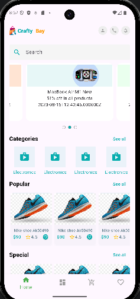
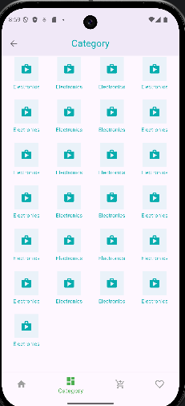
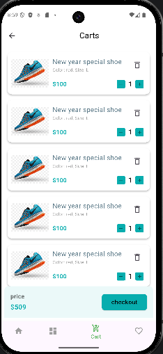
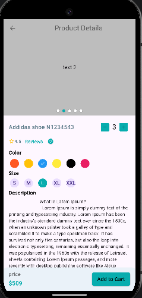

# craftybay_ecommerce_app

# ayuuto_savings_app
<p align="center">
  
  
  
  
  

## Screenshots (Light mode)

Login screen                    |    SignUp Screen     |                                 Admin HomeScreen                                  |  User Management
:-------------------------:|:--------------------:|:---------------------------------------------------------------------------------:|:-------------------------:
image.1.PNG|  | ) |)


## 🚀 Features :
```
• Bottom navigation animation when switch from one screen to another
• Fade animation for food items in detail screen and list views
• Delete single food item from cart by swipe item to right side
• Automatically delete single item from cart by set its value to zero
• Increase or Decrease quantity for each food item in cart screen
• Display food list on the food list screen
• Real-time calculation of total price in the cart screen
• Select quantity for each item on detail screen
• Filter foods by category
• State management with GetX 
```


## Directory Structure (GetX version)
```

## project structure
- lib
  - main.dart
  - screens
    - home_screen.dart
    - product_details_screen.dart
    - cart_screen.dart
    - checkout_screen.dart
  - models
    - product.dart
    - cart_item.dart
  - providers
    - product_provider.dart
    - cart_provider.dart